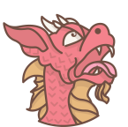

  

# Projeto Tartarus

Tartarus é uma plataforma em desenvolvimento onde players e mestres de RPG de mesa poderão se encontrar e jogar partidas.

Este é o repositório do front-end do projeto.

## Pré-requisitos
- Node.js
- NPM

## Começando
Para rodar o projeto em seu computador, siga os passos abaixo:

1. Tenha uma instância rodando da [tartarus-api](https://github.com/Kinark/tartarus-api);
2. Instale as dependências com `npm install`;
3. Inicie o projeto localmente com `npm start`;
4. Acesse a plataforma em http://localhost:8080
